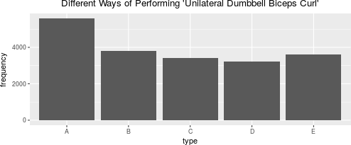

### Overview

Using devices such as Jawbone Up, Nike FuelBand, and Fitbit it is now possible
to collect a large amount of data about personal activity relatively
inexpensively. These type of devices are part of the quantified self movement -
a group of enthusiasts who take measurements about themselves regularly to
improve their health, to find patterns in their behavior, or because they are
tech geeks. One thing that people regularly do is quantify how much of a
particular activity they do, but they rarely quantify how well they do it.

This paper includes creation model algorithm, which predicts the way how
physical exercise has being done based on information from accelerometers.

### Exploratory Analysis

This paper is using [Human Activity Recognition][1] source for obtaining and
analysing [training][2] and [testing][3] data. This data includes "Unilateral
Dumbbell Biceps Curl" exercise, performed by participants in 1 set of 10
repetitions using different fashions, located in column with name = "classe":

* exactly according to the specification (Class A)
* throwing the elbows to the front (Class B)
* lifting the dumbbell only halfway (Class C)
* lowering the dumbbell only halfway (Class D)
* throwing the hips to the front (Class E)


The 'train' part of data has a chart in Appendix A:

* the biggest amount of data in 'train' dataset has type A (5k+)
* the smallest amount of data in 'train' dataset has type D (near 3k)

### Building Prediction Model

The target to predict is 'classe' which is factor variable. The best choises
to predict this value among models are 'Decision Tree' and 'Random Forest'.
Both models are considered in this paper, expected out-of-sample error is based
on accuracy (1 - accuracy).

#### Prepare Data

The data preparation phase includes the following steps:

* remove columns which doesn't apply to current research: 'X', 'user_name',
'raw_timestamp_part_1', 'raw_timestamp_part_2', 'cvtd_timestamp', 'new_window',
'num_window')
* remove all columns, containing more than 80% of NAs
* check that all chosen columns aren't 'zeroVar' or 'nzv'
* prepare train(80%)/test(20%) data for cross-validation procedure


```r
set.seed(0)

prepare <- function(dataset) {
        ds <- dataset[, -c(1:7)]
        ds[, colSums(is.na(ds)) / nrow(ds) < 0.2]
}
train <- prepare(har.train)
nzv <- nearZeroVar(train, saveMetrics = TRUE)
sum(nzv$zeroVar)
```

```
## [1] 0
```

```r
sum(nzv$nzv)
```

```
## [1] 0
```

Based on information after calling 'nearZeroVar' function we assume that data
preparation stage was completed. For building model 53 features were selected.


```r
data_subset <- createDataPartition(y = train$classe, p = 0.80, list = FALSE)
partition.train <- train[data_subset, ]
partition.test <- train[-data_subset, ]
```

#### Decision Tree

```r
dt.model <- rpart(classe ~ ., data = partition.train, method = "class")
dt.prediction <- predict(dt.model, partition.test, type = "class")
dt.conf_matrix <- confusionMatrix(dt.prediction, partition.test$classe)
dt.conf_matrix$overall
```

```
##       Accuracy          Kappa  AccuracyLower  AccuracyUpper   AccuracyNull 
##   7.295437e-01   6.568839e-01   7.153487e-01   7.433960e-01   2.844762e-01 
## AccuracyPValue  McnemarPValue 
##   0.000000e+00   1.747178e-51
```

#### Random Forest


```r
rf.model <- randomForest(classe ~ ., data = partition.train, method = "class")
rf.prediction <- predict(rf.model, partition.test, type = "class")
rf.conf_matrix <- confusionMatrix(rf.prediction, partition.test$classe)
rf.conf_matrix$overall
```

```
##       Accuracy          Kappa  AccuracyLower  AccuracyUpper   AccuracyNull 
##      0.9946470      0.9932281      0.9918289      0.9966834      0.2844762 
## AccuracyPValue  McnemarPValue 
##      0.0000000            NaN
```

#### Decision Tree vs Random Forest Comparison


     model        accuracy     conf.int.left    conf.int.right 
---------------  -----------  ---------------  ----------------
 Decision Tree    0.7295437      0.7153487        0.7433960    
 Random Forest    0.9946470      0.9918289        0.9966834    

The model based on Random Forest algorithm has higher accuracy (99.46% vs
72.95%), thus, has smaller error. Therefore, the model based on Random Forest
has been chosen.

#### Final Test Data Prediction


```r
predict(rf.model, prepare(har.test), type = "class")
```

```
##  1  2  3  4  5  6  7  8  9 10 11 12 13 14 15 16 17 18 19 20 
##  B  A  B  A  A  E  D  B  A  A  B  C  B  A  E  E  A  B  B  B 
## Levels: A B C D E
```

### Summary

According to the research in paper, the model which is based on Random Forest
algorithm fits the necessity to predict type/way of physical activity with
accuracy 99.46%.

### Appendix A: Human Activity Recognition Types Plot


```r
har_plot <- ggplot(har.train, aes(classe)) +
        geom_bar() +
        xlab("type") +
        ylab("frequency") +
        ggtitle("Different Ways of Performing 'Unilateral Dumbbell Biceps Curl'") +
        theme(plot.title = element_text(hjust = 0.5))
har_plot
```



[1]: http://groupware.les.inf.puc-rio.br/har 
[2]: https://d396qusza40orc.cloudfront.net/predmachlearn/pml-training.csv
[3]: https://d396qusza40orc.cloudfront.net/predmachlearn/pml-testing.csv
